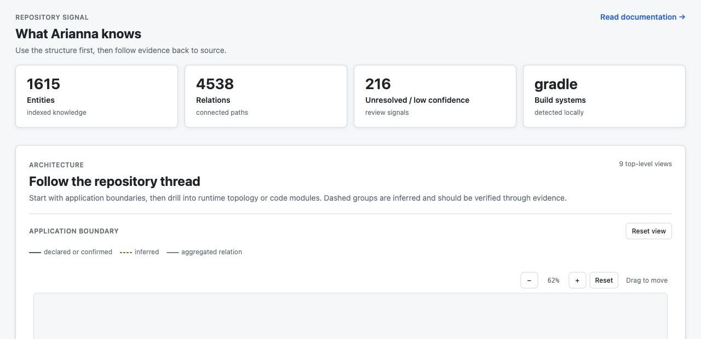

# Arianna

Arianna builds a local, evidence-first map of a software repository. It indexes source files, JVM symbols, framework wiring, configuration, documentation and Git snapshots into a queryable SQLite knowledge base.

Use it to find relevant code, inspect relationships and estimate the impact of a change. Arianna exposes the same analysis engine through the `learn` CLI, a local Web Explorer and an MCP server for external AI agents.

## See it in action

The local Web Explorer turns repository knowledge into an explorable architecture map, with evidence-backed entities, relationships and review signals.



Run `learn serve .` to open the same view for your repository.

## What Arianna does

- indexes Java and Kotlin repositories, with a conservative JVM fallback when SCIP is unavailable;
- recognizes common Spring wiring, configuration, endpoints, Ktor routes and Docker Compose topology;
- preserves repository, revision, file, line, origin and confidence evidence;
- compares a clean baseline with the working tree or two Git revisions;
- reports callers, implementations, tests, framework wiring, documents and unresolved edges affected by a change;
- provides deterministic CLI, MCP and local Web Explorer access to the same knowledge;
- runs locally, stores data in `.arianna/knowledge.db`, does not send repository content to a hosted service and does not require an LLM.

The current release is a local, single-repository MVP. See [limitations](docs/limitations.md) and the [roadmap](docs/roadmap.md) for boundaries and future work.

## Quick start

Requirements:

- JDK 21;
- Git for Git-aware analysis;
- the included Gradle wrapper;
- optional `scip-java` and `scip` on `PATH` for higher-fidelity semantic indexing.

```bash
./gradlew installDist
build/install/learn/bin/learn --version
build/install/learn/bin/learn .
build/install/learn/bin/learn search-knowledge "PaymentService" .
```

`learn .` creates or refreshes the clean baseline index. The database is repository-local and ignored by Git. Run `learn preflight .` to inspect optional indexer prerequisites.

For a self-contained, platform-specific package with an embedded Java runtime:

```bash
./gradlew packageAutonomous
./gradlew packageAutonomousZip
```

The installer builds that package and installs `learn` for the current user on macOS or Linux:

```bash
./scripts/install.sh
```

## Common workflows

Index and inspect a clean repository:

```bash
learn index .
learn status .
learn find-symbol PaymentService .
learn references PaymentService.process .
learn implementations PaymentService .
learn relations class:PaymentService .
```

Analyze uncommitted work without replacing the clean baseline:

```bash
learn index --working-tree .
learn diff --working-tree .
learn impact --working-tree .
learn plan-refactor --working-tree .
learn verify-change --working-tree .
```

Compare two Git revisions:

```bash
learn impact --base <base> --head <head> --path .
learn plan-refactor --base <base> --head <head> --path .
learn verify-change --base <base> --head <head> --path .
```

Use `--json` for automation. Reports are evidence-backed and complement, but never replace, the repository compiler and tests.

## MCP and Web Explorer

Start the local MCP server over stdio:

```bash
learn mcp --path .
```

It provides `search_knowledge`, `find_symbol`, `find_references`, `find_implementations`, `find_relationships`, `get_evidence`, `analyze_change`, `plan_refactor` and `verify_change`.

Start the local read-only Web Explorer:

```bash
learn serve .
```

Open <http://127.0.0.1:8080>. To share an indexed baseline without the source repository, use `learn export` and open the resulting offline snapshot or serve it with `learn snapshot`. See the [MCP](docs/mcp.md) and [Web Explorer](docs/web-explorer.md) guides.

## Documentation

Start with the [documentation index](docs/README.md). The most useful paths are:

- [Getting started](docs/getting-started.md) — installation, SCIP setup and first run;
- [Usage](docs/usage.md) — CLI workflows and reports;
- [Architecture](docs/architecture.md) — indexing, model, storage and evidence;
- [Configuration](docs/configuration.md) — ignore rules and repository-local state;
- [Limitations](docs/limitations.md) — what static analysis cannot prove;
- [Roadmap](docs/roadmap.md) — all deliberately unimplemented work;
- [Contributing](docs/contributing.md) — development and contribution workflow.

## Development

```bash
./gradlew test
./gradlew build
./gradlew installDist
```

The project is Kotlin/JVM 21 and uses Gradle. Read [AGENTS.md](AGENTS.md) for repository maintenance rules and [Contributing](docs/contributing.md) for the public development workflow.

## License

Arianna is available under the [Apache License 2.0](LICENSE).
